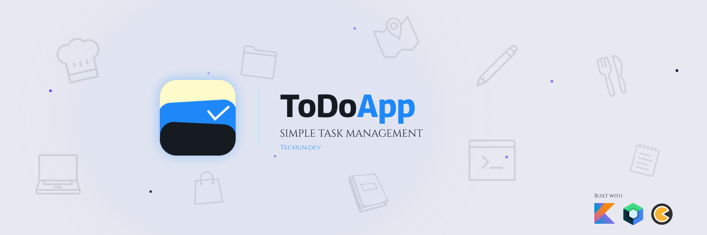
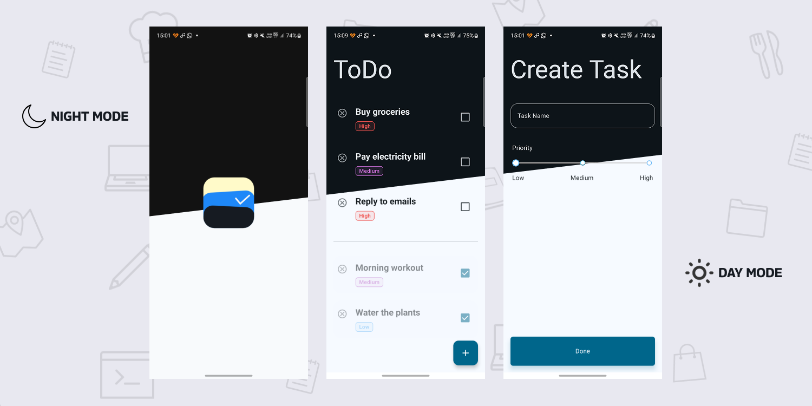

<p align="center">
  
</p>

<p align="center">
  
  
  
  
  
</p>

<br/>

# ✅ ToDoApp — Simple Task Management

Una aplicación de gestión de tareas simple y elegante, con soporte para prioridades, modo claro/oscuro y animaciones fluidas, desarrollada en Android con Jetpack Compose por [Techun.dev](https://github.com/techundev).

---

## 📱 Pantallas

| Pantalla         | Descripción |
|-------------------|---|
| **Splash**        | Splash screen animado nativo con Android 12 Splash Screen API |
| **Home / ToDo**   | Lista de tareas separadas en pendientes y completadas, con badge de prioridad y estado |
| **Create Task**   | Creación de tareas con nombre y selector de prioridad (Low / Medium / High) |

### 🖼️ Vista previa

<p align="center">
  
</p>

---

## 🎨 Paleta de Colores

| Color | Hex | Uso |
|---|---|---|
| 🟦 Azul primario | `#1B6FE0` | Barra de progreso, acentos, ícono de la app |
| 🖤 Negro / Night | `#0E1116` | Fondo modo oscuro |
| ⬜ Blanco / Day | `#FFFFFF` | Fondo modo claro |
| 🟡 Amarillo | `#F5E6A8` | Detalle del ícono / branding |
| 🟢 Teal | `#0E6E78` | Botones de acción (FAB, "Done") |
| 🔴 Rojo (High) | `#D9534F` | Badge de prioridad alta |
| 🟣 Púrpura (Medium) | `#7B4FA3` | Badge de prioridad media |
| 🔵 Celeste (Low) | `#8FC1E3` | Badge de prioridad baja |

---

## 🏗️ Arquitectura

El proyecto implementa **Clean Architecture** con el patrón **MVVM**, **Unidirectional Data Flow (UDF)** y `StateFlow`, organizado por capas.

```
app/
├── core/
│   ├── composables/      → ToDoText
│   ├── database/
│   │   ├── dao/          → TaskDao
│   │   ├── database/     → TaskDatabase
│   │   └── entity/       → TaskEntity
│   ├── di/               → DatabaseModule
│   ├── nav3/             → NavRoutes (sealed interfaz), NavWrapper
│   └── utils/            → Ext                         
│                            
├── home/
│   ├── data/
│   │   ├── mapper/       → TaskMapper
│   │   ├── repository/   → TaskRepositoryImpl
│   │   └── utils/        → HomeUtils
│   ├── di/               → HomeModule
│   ├── domain/
│   │   ├── model/        → HomeResult, HomeScreenPhase, PriorityStatus, Task, TaskStatus
│   │   ├── repository/   → HomeRepository
│   │   └── usecase/      → DeleteTaskByIdUseCase, GetCompletedTasksUseCase
│   │                       GetPendingTasksUseCase, ToggleTaskCompletedUseCase
│   └── ui/               → HomeScreen, HomeViewModel
│       └── composable/   → ToDoBadge, ToDoPriorityBadge,
│                           ToDoTaskFloatingActionButton,ToDoTaskItem
│                            
├── create/
│   ├── data/
│   │   ├── mapper/       → TaskMapper
│   │   └── repository/   → AddTaskRepositoryImpl
│   ├── di/               → AddTaskModule
│   ├── domain/
│   │   ├── model/        → CreateTaskResult
│   │   ├── repository/   → CreateTaskRepository
│   │   └── usecase/      → AddTaskUseCase
│   └── ui/               → CreateTaskScreen, CreateTaskViewModel
│       └── composable/   → ToDoButton, ToDoTextField
│
└── splash/
    └── ui/               → SplashScreenViewModel
```

---

## 🛠️ Stack Tecnológico

| Categoría | Tecnología |
|---|---|
| **Lenguaje** | Kotlin |
| **UI** | Jetpack Compose + Material 3 |
| **Arquitectura** | MVVM + Clean Architecture + UDF + Use Cases |
| **Inyección de dependencias** | Koin |
| **Persistencia** | Room Database |
| **Navegación** | Navigation 3 (Nav3) |
| **Splash** | Android 12 Splash Screen API |
| **Animaciones** | Lottie |
| **Asincronía** | Coroutines + StateFlow / SharedFlow |

---

## 📦 Casos de Uso

| UseCase | Descripción |
|---|---|
| `GetPendingTasksUseCase` | Obtiene el flujo de tareas pendientes desde Room |
| `GetCompletedTasksUseCase` | Obtiene el flujo de tareas completadas desde Room |
| `AddTaskUseCase` | Crea una nueva tarea con nombre y prioridad |
| `ToggleTaskCompletionUseCase` | Marca/desmarca una tarea como completada (con UI optimista) |
| `DeleteTaskUseCase` | Elimina una tarea (con UI optimista) |

---

## ✨ Características

- ✅ Creación de tareas con **nombre y prioridad** (Low / Medium / High)
- ✅ Separación automática entre **pendientes** y **completadas**
- ✅ **UI optimista** al marcar/desmarcar y eliminar tareas
- ✅ Persistencia local con **Room**
- ✅ **Splash screen** animado con la API nativa de Android
- ✅ Animaciones fluidas con **Lottie**
- ✅ Soporte completo de **modo claro y modo oscuro**
- ✅ Navegación declarativa con **Nav3**

---

## ⚙️ Configuración del Proyecto

### Requisitos

- Android Studio Hedgehog o superior
- Kotlin 2.0+
- minSdk 24
- targetSdk 36

### Instalación

1. Clona el repositorio:
```bash
git clone https://github.com/techundev/ToDoApp.git
```

2. Abre el proyecto en **Android Studio**.

3. Sincroniza las dependencias de Gradle.

4. Ejecuta la app en un emulador o dispositivo físico con Android 7.0 (API 24) o superior.

### Dependencias principales

```kotlin
// Jetpack Compose
implementation(platform("androidx.compose:compose-bom:2025.x.x"))

// Room
implementation("androidx.room:room-runtime:2.7.x")
implementation("androidx.room:room-ktx:2.7.x")
ksp("androidx.room:room-compiler:2.7.x")

// Koin
implementation(platform("io.insert-koin:koin-bom:4.x.x"))
implementation("io.insert-koin:koin-android:4.x.x")
implementation("io.insert-koin:koin-compose:4.x.x")

// Navigation 3
implementation("androidx.navigation3:navigation3-runtime:1.x.x")

// Splash Screen API
implementation("androidx.core:core-splashscreen:1.0.x")

// Lottie
implementation("com.airbnb.android:lottie-compose:6.x.x")
```

---

## 📥 Descarga

¿Quieres probar la app sin compilar el proyecto? Descarga directamente el APK:

[](https://github.com/techundev/ToDoApp/releases/download/v1.0.0/ToDoApp-v1.0.0.aab)

> **Nota:** Es necesario habilitar la instalación de fuentes desconocidas en tu dispositivo Android.
> `Ajustes → Seguridad → Instalar apps desconocidas`

---

## 👨‍💻 Desarrollador

Desarrollado por [Techun.dev](https://github.com/techundev).

---

## 📄 Licencia

Este proyecto es de uso personal y de libre consulta. Desarrollado por [Techun.dev](https://github.com/techundev).
